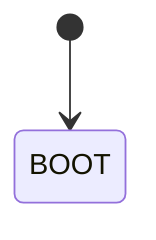

# Obsidian 笔记 → Oink 站点内容规范

> **给 Agent / 协作者**：在 Cursor 中处理「把 Obsidian 笔记发布到 YHY 网站」时，先读本文。  
> 用法示例：`请读 @my-project-docs/OBSIDIAN-TO-OINK.md，把 xxx 整理成博客/文档`  
>  
> **Obsidian 源稿位置**（只读，除非用户明确要求修改）：  
> `D:\MyData\yhy\10tool\obsidian\storage\obsidian\`  
> **发布目标**：`my-project-docs/content/`（Oink / Hugo）

最后更新：2026-09-20（博客须围绕一个目的组织，不确定则问用户）

> [!IMPORTANT] 安全优先
> 站点为 **公开 GitHub 仓库 + GitHub Pages**，任何 push 的内容都可能被检索、 fork、缓存。**正文与代码块**中的真实 IP、域名、端口、密码、Token、API Key 等一律不得原样发布；须脱敏并标明为虚构示例（见 §3）。

---

## 1. 项目与路径

| 项目 | 路径 | 远程 |
| ---- | ---- | ---- |
| 站点（Oink） | `my-project-docs/` | [RyanYhy/YHY-Website](https://github.com/RyanYhy/YHY-Website) |
| ROS 源码 | `raicom2026/` | [RyanYhy/raicom2026](https://github.com/RyanYhy/raicom2026) |

- 对外文档以 **`my-project-docs/content/`** 为准，不是 `raicom2026/docs/`。
- 主题：Hugo Module `github.com/pgsty/oink`（版本见 `go.mod`，当前 v0.6.0）。
- 线上：<https://ryan.0412.online/>

---

## 2. 内容放哪个栏目

| 栏目 | 路径 | 排序 | 适用 |
| ---- | ---- | ---- | ---- |
| 博客 | `content/blog/<slug>/index.md`（**Page Bundle 文件夹**） | **`date`**（新在前） | 带日期的复盘、项目记录、学习笔记整理 |
| 经历 / 文档 | `content/experience/...` | **`weight`**（10/20/30…） | 长期查阅的项目/竞赛文档 |
| 学习 | `content/learn/...` | **`weight`** | 按主题整理的教程/笔记 |
| 友链 | `content/links.md` | — | 单页 |
| 搜索 | `content/search.md` | — | **勿删、勿写正文**（`layout: search`） |

**Agent 默认行为**：

- 用户说「发博客」→ 新建 **`content/blog/<英文-slug>/`** 文件夹，正文写 **`index.md`**，配图放同目录（见 §5.1、§7.8）
- 用户说「RAICOM 文档」→ `content/experience/2026-raicom/`
- **不要改 Obsidian 源文件**，只在 `content/` 新建或修改发布版
- **不要**再新建 `content/blog/xxx.md` 单文件博客（旧文可保留，新文一律用文件夹）

---

## 3. 安全与脱敏（发布前必查）

本站内容一旦 `git push`，即对公网可见（含 Git 历史）。Obsidian 私人笔记里常含内网信息，**迁移到 `content/` 时必须主动审查**，不能假设「只是示例没人会看」。

### 3.1 禁止或必须脱敏的内容

| 类型 | 禁止原样发布 | 发布版处理方式 |
| ---- | ------------ | -------------- |
| 服务器 / 虚拟机地址 | 真实公网 IP、内网 IP（`192.168.x.x`、`10.x.x.x` 等） | 用 **`ip1`、`ip2`** 等抽象占位（见下表）；命令行里写 `<ip1>`。勿用看似真实的公网段 |
| 域名 / 主机名 | 真实生产域名、学校/机房主机名 | **`xxx.xxx.com`** 等明显占位，勿用真实可解析域名 |
| 端口 | 与真实环境一一对应的组合（若可推断资产） | `<port1>`、`22222` 等明显占位，或文内说明「自定义端口」 |
| 账号密码 | SSH、数据库、面板、ROS 账号等 | 用户名用 **`username`**；密码用 `***`、`<PASSWORD>`；**绝不**出现真实口令 |
| API Key / Token / Secret | GitHub PAT、OpenAI Key、云服务密钥、JWT | **整段删除或替换为** `sk-xxxxxxxx`、`ghp_xxxxxxxx`；**不要**上传 |
| 私钥 / 证书 | `id_rsa`、`.pem`、kubeconfig 片段 | 不上传；用「将私钥放在本地、勿提交」等文字说明 |
| 个人敏感信息 | 学号、手机号、家庭地址、未公开邮箱 | 删除或泛化 |
| 截图 / 图片 | 终端里带 IP、密钥、窗口标题含用户名 | 打码后再放入 `static/images/`，或换示意图 |

**适用范围**：以上规则对 **正文段落、表格、提示块、Mermaid、代码块、命令行示例** 全部生效——代码块同样会进 Git 并被搜索引擎索引，不能认为「只在代码里」就安全。

**推荐占位符约定**（全文统一，避免 `203.0.113.x` 这类「像真 IP」的写法）：

| 占位 | 含义 | 示例用法 |
| ---- | ---- | -------- |
| `ip1` | 主服务器 / VPS | `ssh username@<ip1>` 或 `ssh username@ip1` |
| `ip2` | 第二台机器、或「允许连入的来源 IP」 | `ufw allow from <ip2> ...` |
| `xxx.xxx.com` | 虚构域名 | `ssh username@xxx.xxx.com` |
| `username` | 虚构登录用户名 | `adduser username` |
| `<port1>` | 自定义 SSH 等服务端口 | `ssh -p <port1> username@<ip1>` |

文首或代码块上方用 `[!NOTE] 虚构示例` 说明 `ip1`、`ip2`、`username`、`xxx.xxx.com` 等为占位，需读者自行替换。

### 3.2 替换示例时的写法

脱敏后，在文中**明确说明是虚构示例**，避免读者误当成可连的真实环境：

````markdown
> [!NOTE] 虚构示例
> 以下 ip1、ip2、username、xxx.xxx.com 与路径均为演示占位，非真实服务器。

```bash
ssh username@<ip1> -p <port1>
ssh username@xxx.xxx.com -p <port1>
export ROS_MASTER_URI=http://<ip2>:11311/
sudo ufw allow from <ip2> to any port <port1> proto tcp
```
````

或在步骤旁加一句：「请将 `<ip1>`、`<port1>` 替换为你自己的主机与端口。」

### 3.3 绝对不要提交的文件

- `.env`、`.env.local`、含密钥的 `config.yaml` / `secrets.yaml`
- 真实 `kubeconfig`、数据库连接串、Obsidian 插件导出的 token
- 未打码的终端截图、带查询参数的私有链接

`git add -A` 前用 `git status` / `git diff` 扫一眼；若已误提交密钥，**轮换密钥**并清理 Git 历史，不能仅改文件了事。

### 3.4 Agent 迁移时的安全职责

1. 通读 Obsidian 源稿与将要写入的 `content/`，**主动查找** IP、密码、Key、内网 URL。
2. 发现敏感信息：**替换为 `ip1` / `ip2` / `<port1>` 等占位符**（§3.1 表），并加 `[!NOTE] 虚构示例` 或等价说明（除非用户明确提供可公开的地址）。
3. **不要**把 Obsidian 里的真实凭证「整理得更清楚」后发布出去。
4. 用户未确认时，**不要** `git push`；若 diff 中含疑似密钥，应提醒用户并停止提交。
5. 不确定是否敏感时，**默认脱敏并向用户说明**改了什么。

---

## 4. 迁移工作流（Checklist）

1. 读取 Obsidian `.md`（含 front matter 若有）。
2. **先确定目的**（§4.1）：这些笔记要完成什么？章节必须按该目的串成一条线。**不确定就先问用户，不要猜完硬写。**
3. **安全审查与脱敏**（§3）：正文 + 代码块 + 图片。
4. 选定目标栏目与文件名（博客用英文 slug，**建文件夹 + `index.md`**，见 §5.1）。
5. 重写 front matter（见 §5），**不要**只留 Obsidian 的 `date:`。
6. 正文按 §6 替换 Obsidian 专有语法。
7. 按 §7 使用 Oink 组件；博客若有头图，按 §7.8 插入并做 §3 脱敏检查。
8. 本地构建验证：`cd my-project-docs && hugo server` 或 `hugo --minify`。
9. `git diff` 再次确认无密钥、无真实内网地址后，在用户要求时再 `commit` / `push`（未经要求不要 commit）。

### 4.1 围绕一个目的组织（防止割裂）

用户给的多篇 Obsidian 笔记通常是**为完成同一件事**积累的，不是互不相关的百科条目。整理成博客时：

1. **先用一句话说清目的**（例如：「在 VMware Ubuntu 里跑通自定义内核，并加载自己的 `.ko`」）。写在文章开头，后面每一节都要回答「这一步如何推进该目的」。
2. **按完成路径排章节**，不要按源文件名机械拼接。该合并的合并，该当前置条件的放前面。
3. **节与节之间写清因果**：上一节产出什么、下一节为什么需要它。避免「虚拟机一节、内核一节」并列堆叠、读完仍不知道为什么要一起看。
4. **结尾回收主线**：用检查表或小结把各段重新串回目的，不要只停在最后一步的命令上。
5. **不确定目的时必须问用户**，例如：「这两篇是操作系统实验的一条线，还是两篇独立文章？」在得到答复前不要写成割裂的拼盘。
6. **标题用陈述性技术用语**，避免口语标题（如「这条线为什么从…」「串起来看一眼」「不会飘的地址」）。正文可以略口语，`##` / `###` 应像文档目录：对象 + 动作，或术语本身。

反例：把「VMware 静态 IP」和「编译内核」各写一块，中间没有「为什么先配网 / 为什么必须在这台虚拟机里编」。正例：先交代实验环境 → 配稳虚拟机网络 → 再在这台机上换内核、写模块。

---

## 5. Front matter 模板

### 5.1 博客 — Page Bundle（默认，新文必遵）

**每篇新博客 = 一个文件夹**，不要用 `content/blog/xxx.md` 单文件。

```text
content/blog/<英文-slug>/
├── index.md                 ← 文章正文（不是 xxx.md）
├── cover.png                ← 头图（推荐，可选）
└── 其他配图.png             ← 同篇多张图时放这里
```

- **URL** 仍是 `/blog/<英文-slug>/`（与以前 `xxx.md` 相同）。
- 图片用**相对路径**引用，不要写 `/images/...`。
- `git add` 时 add **整个文件夹**：`git add content/blog/<slug>/`

`index.md` front matter 模板：

```yaml
---
title: 文章完整标题
linkTitle: 列表短标题
description: 一句话摘要
date: 2026-08-31
tags: [标签1, 标签2]
---
```

头图插入位置：**引言段落后、第一个 `##` 之前**（或 `[!NOTE] 虚构示例` 之前，视排版而定）：

```markdown
最近在 VPS 上折腾 SSH……


{caption="一句话说明图在讲什么"}

> [!NOTE] 虚构示例
> …
```

从单文件迁移为 Page Bundle：

```powershell
mkdir content/blog/my-slug
Move-Item content/blog/my-slug.md content/blog/my-slug/index.md
# 再把图片复制进 content/blog/my-slug/
```

### 5.2 文档栏目 `_index.md`（分区根页）

```yaml
---
title: 栏目完整名
linkTitle: 侧栏短名
description: 栏目摘要
weight: 20                  # 顶栏/同级排序
type: docs                  # 文档型侧栏
icon: fa-solid fa-book-open # 可选
sidebar_expanded: true
cascade:
  type: docs                # 子页继承
---
```

### 5.3 文档子页 `overview.md` 等

```yaml
---
title: 概述
linkTitle: 概述
description: 本页摘要
weight: 10                  # 同目录内排序，用 10 的倍数
---
```

| 字段 | 博客 | 文档 |
| ---- | ---- | ---- |
| `date` | 必填 | 一般不用 |
| `weight` | 可省略 | 同目录排序必填 |
| `type: docs` | 不需要 | 栏目 `_index.md` + cascade |

---

## 6. Obsidian → Oink 语法对照（必改）

| Obsidian | Oink / Markdown | 操作 |
| -------- | --------------- | ---- |
| `==高亮==` | `**加粗**` | 全部替换 |
| `[[页面名]]` | `[显示文字](/站内路径/)` 或外链 | 改为真实链接；无法对应则删或留待补 |
| `![[image.png]]` | `` | 见 §7.4 |
| 仅 `date:` 的 front matter | 完整 YAML（§5） | 补全 `title`、`description` 等 |
| `> [!note]` | `> [!NOTE]` | 类型名大写更规范（小写通常也可用） |

**保留不变**：普通 Markdown 标题、列表、表格、围栏代码块（建议加语言标识如 `bash`）。

---

## 7. Oink 可用格式（写作规范）

官方组件索引：<https://oink.pgsty.com/zh/docs/components/>

### 7.1 标题锚点

```markdown
## 小节标题 {#anchor-id}
```

- `{#id}` **不显示**在页面上，供目录、文内链接、分享定位。
- id 建议英文小写+连字符：`{#lookup-order}`，勿用中文。
- 文内链接：`[整理步骤](#steps)` — 方括号是**显示文字**，圆括号是**跳转目标**。
- 跨页：`[udev](/experience/2026-raicom/usage/#udev)`

### 7.2 提示块（Callout）

```markdown
> [!NOTE] 可选标题
> 正文

> [!IMPORTANT] 必做
> ...

> [!WARNING] 易踩坑
> ...
```

### 7.3 步骤列表

```markdown
1. 第一步说明
1. 第二步说明
1. 第三步说明
{.steps}
```

- 每行都用 `1.`，**末尾单独一行** `{.steps}`。

### 7.4 图片与图注（重要）

**图注必须写在图片下一行，不能与 `` 同一行。**

```markdown

{caption="系统分层：由硬件到比赛任务"}
```

| 方式 | 存放 | 适用 |
| ---- | ---- | ---- |
| A. 全局静态图 | `static/images/<子目录>/` | **文档**（如 RAICOM）、多页复用的图 |
| B. 页面包 | `content/blog/<slug>/index.md` + 同目录图片 | **博客（默认）**、一篇多图 |

- **新博客一律用 B**；文档继续可用 A。
- `{caption="..."}` 显示在**图片正下方**；不写则只有图。
- `![alt]` 是无障碍/加载失败文字，与 caption 不同。

**错误示例（会导致图裂 + 图注变纯文本）：**

```markdown
{caption="..."}
```

### 7.5 代码块

````markdown
```bash
rospack find pkg_name
```
````

可选增强（Oink）：` ```bash {title="..." copy="all"} ` — 见官方 Code blocks 文档。

**安全**：代码块内同样不得出现真实密码、Token、内网 IP；示例命令用 **`ip1`、`ip2`、`<port1>`**（§3.1），必要时在块上方加「虚构示例」说明。

### 7.6 Mermaid

````markdown

````

- Mermaid **默认左对齐**，窄图在宽栏里会显得「不居中」——属正常现象。
- 围栏上 **不能** 写 `{caption=...}`；要居中美观可改用静态 PNG + §7.4。
- 像素级控制、图注编号 → 用静态图，见 RAICOM `overview.md`。

### 7.7 表格、链接

- 标准 GitHub Flavored Markdown 表格即可。
- 站内链接优先用根路径：`/blog/xxx/`、`/experience/2026-raicom/usage/`

### 7.8 博客头图与 AI 绘图提示词

每篇博客**建议配一张头图**（有趣 + 能说明文章主线），放在 Page Bundle 同目录，文件名如 `cover.png` 或 `ssh-security-fun-cover.png`。

#### 头图放哪、怎么写

见 §5.1。相对路径 + 图注换行：

```markdown

{caption="读者一眼能看懂这张图在讲什么"}
```

#### 选什么类型的图

| 类型 | 适合 | 示例 |
| ---- | ---- | ---- |
| 路径/流程说明 | 技术笔记主线清晰 | 云安全组 → UFW → 服务 |
| 对比/前后 | 加固、迁移、踩坑 | 默认配置 vs 加固后 |
| 趣味隐喻 | 博客读者第一印象 | 笔记本小人拿钥匙过门禁 |
| 终端截图 | **慎用** | 易漏 IP/用户名，需打码或改用示意图 |

优先 **flat vector / 轻手绘 / 16:9 宽图**，与 Oink 技术文档风格接近；避免 photorealistic、真实品牌 logo。

#### AI 出图提示词模板（英文，给 Cursor GenerateImage 等）

按块拼接，**必须**在 prompt 里写清安全约束：

```text
[风格] A fun but clean tech blog header illustration, flat vector, light soft background, 16:9 wide, readable Chinese labels, rounded cards, blue/gray with orange accents, cute but professional, Oink-style technical blog.

[主体] Scene: <用 1–2 句描述文章核心，例如 laptop → three security gates → server castle>.

[标签] Labels in Chinese only where needed: <列出图中要出现的占位词，如 ip1, username, port> — use placeholder text only.

[安全 — 必写] No real IP addresses, no real domains, no passwords, no API keys, no real usernames, no terminal screenshots with sensitive data, no brand logos.

[尺寸] aspect_ratio: 16:9
```

**占位符进图时**只用 §3.1 约定：`ip1`、`ip2`、`username`、`xxx.xxx.com`、`<port1>`，不要写真实值。

#### 已验证示例：SSH 安全加固头图

主题：Linux SSH 登录与安全加固。可直接改主体后复用：

```text
A fun but clean tech blog header illustration for a Chinese article about Linux SSH login and security hardening. Light soft background, flat vector style with a little hand-drawn charm. Scene: on the left a cute laptop character holds a key labeled "private key" and tries to reach a small server castle on the right. Between them are three playful security gates labeled in Chinese: "云安全组", "UFW", "sshd". Above the path show simple placeholder labels only: "ip1", "username", "port" — no real IP address, no real domain, no passwords, no API keys. Add a small warning badge saying "权限 0664?" near an oversized key, and a green check badge saying "chmod 600". Wide 16:9 blog cover, readable Chinese labels, modern technical document aesthetic, colors blue gray with orange accents, rounded cards, no photorealistic people, no real brands.
```

生成后**人工检查**：图中是否误出现像真 IP 的数字、真实域名、英文乱码标签；有问题则重生成或手改。

#### 不用 AI 时的替代

- [Excalidraw](https://excalidraw.com/)：手绘风、快
- draw.io：流程图规整
- 导出 **PNG**，宽图约 **1200×675（16:9）** 或更大

#### Agent 职责

- 用户要「有趣头图」时，先读文章小结再写 prompt（§7.8 模板 + 安全句）。
- 图片放入 `content/blog/<slug>/`，更新 `index.md` 引用；**不要**只放在 `assets/` 或 `static/` 而漏进 Page Bundle（除非用户指定全局图）。
- 头图与正文一样遵守 §3 脱敏。

---

## 8. `content/` 目录规则

```
content/
├── _index.md              # 首页
├── search.md              # 搜索壳页，勿动
├── links.md               # 友链
├── blog/                  # 博客：每篇一个子文件夹 + index.md（Page Bundle）
├── experience/            # 项目/经历（weight，type: docs）
└── learn/                 # 学习笔记（weight，type: docs）
```

| 文件 | 作用 |
| ---- | ---- |
| `_index.md` | 该文件夹的**目录/landing 页** |
| `page.md` | 与该目录 `_index.md` 同级的**一篇**文章 |
| `subdir/index.md` | 页面包（URL 同 `subdir.md`） |

- **新建子文件夹 = 侧栏多一层 = URL 多一段。**
- 同级多篇 `.md` 用 `weight: 10, 20, 30…` 排序。

---

## 9. 本地命令（Windows / PowerShell）

日常写内容**不需要** `make`（Windows 常未安装）。

| 目的 | 命令 |
| ---- | ---- |
| 日常预览 | `cd my-project-docs` → `hugo server` |
| 正式构建（≈ CI） | `hugo --cleanDestinationDir --minify` |
| 接近生产预览 | `hugo server --environment production --minify` |

改 **Oink 主题** 时才需 `make dev` / `make check`（依赖上级目录 `../oink` 克隆）；见 `Makefile`，或在 Git Bash 中执行。

---

## 10. 发布到 GitHub Pages

```powershell
cd my-project-docs
git add content/blog/<slug>/          # 博客：整个 Page Bundle 文件夹
git commit -m "blog: 简短说明"
git push origin main
```

- push 到 `main` 后 GitHub Actions 自动构建（`.github/workflows/pages.yml`）。
- **未经用户明确要求不要 commit / push。**
- **提交前**：再次确认 diff 中无 API Key、密码、真实服务器地址（§3）；勿 `git add` `.env` 等敏感文件。

---

## 11. 常见错误

| 现象 | 原因 | 修复 |
| ---- | ---- | ---- |
| 图注显示为 `{caption="..."}` 纯文本 | caption 与图片同一行 | caption 移到下一行（§7.4） |
| 图片裂图 + alt 文字裸露 | caption 同行、路径错误、Page Bundle 漏提交图片 | caption 换行；确认图片在 `content/blog/<slug>/` 且已 `git add` |
| `[[双链]]` 原样出现在页面 | Obsidian 语法未转换 | 改为 Markdown 链接 |
| Mermaid 偏左、右侧空白 | SVG 默认左对齐 | 可接受；或导出 PNG |
| 博客不显示 | `date` 在未来且无 `-DFE` | 改 date 或用 `hugo server -DFE` |
| 侧栏顺序不对 | `weight` 未设或跨目录理解错误 | weight 只在**同一文件夹**内比较 |
| 公开仓库出现密钥 / 内网 IP | 未做 §3 脱敏就 push | 轮换密钥、脱敏后新 commit；勿以为删文件即可 |

---

## 12. 本项目范例（对照用）

| 类型 | 文件 |
| ---- | ---- |
| 博客（Page Bundle + 头图） | `content/blog/linux-ssh-security-notes/` |
| 博客（Page Bundle + 头图） | `content/blog/ros-workspace-migration/` |
| 博客（Page Bundle + 头图） | `content/blog/oink-site-setup-notes/` |
| 博客（Page Bundle + 头图） | `content/blog/custom-linux-kernel-in-vm/` |
| 文档 + 图注 + 步骤 | `content/experience/2026-raicom/overview.md` |
| 栏目 `_index` + TOC 小节 | `content/experience/2026-raicom/_index.md` |
| 博客栏目配置 | `content/blog/_index.md` |

---

## 13. Agent 整理 Obsidian 为博客时的写作要求

1. **安全（最高优先级）**：按 §3 脱敏；正文、代码块、**头图内文字**同等对待；IP 用 `ip1`/`ip2` 等占位；疑似密钥时提醒用户且勿 push。
2. **先定目的再动笔**（§4.1）：多篇笔记按**同一完成路径**组织；节与节写清因果；结尾回收主线。**目的说不清就问用户**，不要写成互不相关的章节拼盘。
3. **博客结构**：新文一律 **`content/blog/<slug>/index.md` Page Bundle**（§5.1）；配图放同目录；需要头图时按 §7.8 写 prompt 或引导用户确认。
4. **语气**：比 Obsidian 草稿更像「博客/文档」——有简短引言、逻辑分段、必要时加小结；不照抄口语碎片。**章节标题不要口语化。**
5. **结构**：目的 → 前置条件 → 步骤 → 验证 → 小结；长文用 `##` + `{#id}`。
6. **组件**：操作步骤用 `{.steps}`；注意事项用 `[!NOTE]` / `[!WARNING]`。
7. **链接**：Obsidian 双链改为本站可点击路径或 GitHub 外链。
8. **源稿**：只读 Obsidian；输出只写入 `content/`（博客图进 Page Bundle；文档大图进 `static/images/`）。改站默认先改 `my-project-docs-vercel/`，再同步 `my-project-docs/`。
9. **范围**：最小改动；不顺手改无关页面或配置。

---

## 14. 延伸阅读

- [Oink 教程书](https://oink.pgsty.com/zh/book/)
- [Oink 组件](https://oink.pgsty.com/zh/docs/components/)
- 工作区总览：`AGENT_CONTEXT.md`（RAICOM 架构与文档路径）
