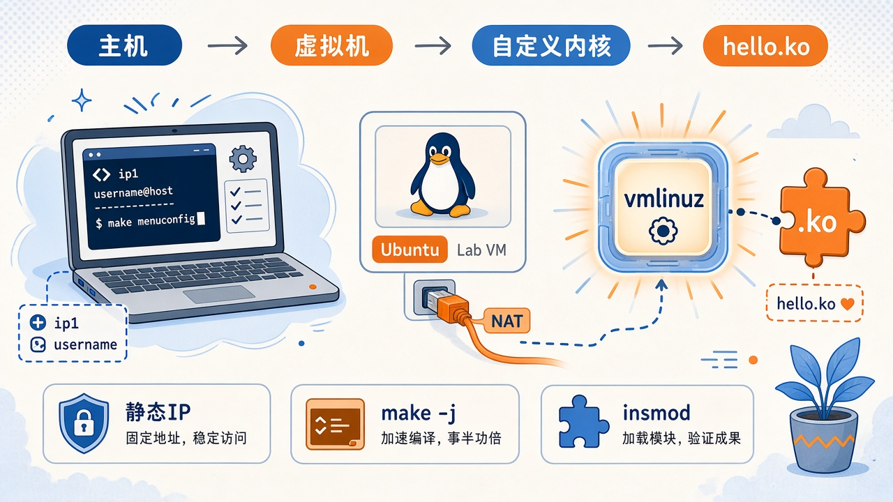

This article has one goal: **compile and install a custom kernel in Ubuntu running inside VMware, then load a .ko module I wrote myself**.

Compilation and kernel replacement both happen in that virtual machine. They consume CPU, memory, and disk space and involve GRUB. Unstable networking can interrupt long builds or SSH sessions; without booting the new kernel, the module will not match the running version. The order is therefore static IP first, custom kernel second, and module last.


{caption="Host → Ubuntu virtual machine → custom vmlinuz → hello.ko"}

> [!NOTE] Illustrative placeholders
> `ip1` is the host's address on VMnet8, `ip2` is the NAT gateway, and `ip3` is the virtual machine's static address. These and `username` are placeholders. Use the actual subnet shown in your Virtual Network Editor.

## Why compile the kernel in a virtual machine? {#why-vm}

The kernel is the innermost operating-system layer, managing CPU, memory, disks, network adapters, and process scheduling. Terminals, browsers, and `apt` run in user space. They cannot directly access hardware and instead ask the kernel through system calls such as `read`, `write`, and `mmap`.

| Layer | Examples | Access |
| ----- | -------- | ------ |
| User space | `bash`, browsers, Python | No direct hardware access |
| Kernel | `vmlinuz`, scheduler, drivers | The layer that directly operates hardware |
| Hardware | CPU, memory, network adapters, disks | — |

`uname -r` prints the **currently running** kernel version. A later `.ko` build must use headers and an ABI matching that kernel, so booting the custom kernel first is not optional in this experiment.

My host runs Windows. Although I have also installed Ubuntu in a dual-boot setup, replacing its kernel could affect existing software dependencies. I therefore created a separate VMware machine for this experiment. Builds still consume disk space and time, but snapshots provide a way back without experimenting on my everyday environment. First, give this machine a static IP so DHCP address changes do not interrupt SSH during a long build.

## Configuring a static IP for the virtual machine {#static-ip}

VMware's **VMnet8** uses NAT by default: the virtual machine accesses the network through the host. A network adapter can communicate directly only with devices on its own subnet; traffic outside it goes through the **default gateway**. The path is:

```text
Ubuntu → Gateway (usually .2 on the subnet) → VMware NAT → Windows physical adapter → Internet
```

### Record the VMnet8 subnet and gateway {#vmnet8}

Open **Virtual Network Editor** and select VMnet8:

| Field | Meaning | Placeholder here |
| ----- | ------- | ---------------- |
| Subnet IP | NAT subnet, such as `x.x.x.0` | The subnet itself |
| Gateway IP | Virtual network gateway, usually `.2` | `ip2` |

Then check Windows: Control Panel → Network and Sharing Center → Change adapter settings → **VMware Network Adapter VMnet8**. The host's address on this network is usually `.1`, called `ip1` here.

| Adapter | Purpose |
| ------- | ------- |
| VMnet0 | Bridged networking into the physical LAN; usually no subnet is assigned in the editor |
| VMnet1 | Host-only; DHCP is available by default, without Internet access |
| VMnet8 | NAT; virtual machines access external networks through the host |

> [!WARNING]
> If you use `ip1`, the host, as the gateway instead of `ip2`, the NAT gateway, a common symptom is **being able to ping Windows but not reach the Internet**.

### Configure static IPv4 in Ubuntu {#ubuntu-ipv4}

Settings → Network → IPv4 → **Manual**:

1. Address: `ip3`, on the same subnet; avoid `.0`, `ip1`, `ip2`, and the DHCP pool.
1. Netmask: `255.255.255.0`, a 24-bit prefix.
1. Gateway: `ip2`.
1. DNS: use a public resolver such as `8.8.8.8` or `223.5.5.5`. This specifies the domain-name resolver, not your machine's IP.
{.steps}

Open a new terminal and check:

```bash
hostname -I
```

The output should include `ip3`. The lab machine now has a fixed address for the hours-long kernel build.

## Compiling and installing a custom kernel {#build-kernel}

A kernel does not have to be one giant binary. Features can be built in, `[*]`; built as modules, `[M]`, producing `.ko` files loaded when needed; or omitted, `[ ]`. Use `lsmod` to view loaded modules.

### Prepare the source and .config {#prepare}

Check the current kernel and select a **nearby version** from [kernel.org](https://www.kernel.org). The example uses `5.15.221`: if `uname -r` shows `5.15.0-139-generic`, choosing 5.15.x is simpler than jumping across major versions.

```bash
uname -r
tar -Jxvf linux-5.15.221.tar.xz
cd linux-5.15.221
cp /boot/config-$(uname -r) .config
make olddefconfig
```

| tar option | Meaning |
| ---------- | ------- |
| `-J` | xz compression |
| `-x` | Extract |
| `-v` | List filenames |
| `-f` | The archive filename follows |

`make olddefconfig` supplies defaults for new options in an existing `.config` without an interactive questionnaire. It only updates the configuration; it does not compile the kernel.

The upstream kernel.org source does not include Ubuntu's two certificate files. Clear their paths so the configuration does not point to nonexistent files:

```bash
./scripts/config --file .config --set-str SYSTEM_TRUSTED_KEYS ''
./scripts/config --file .config --set-str SYSTEM_REVOCATION_KEYS ''
```

| Option | Original purpose |
| ------ | ---------------- |
| `CONFIG_SYSTEM_TRUSTED_KEYS` | Build trusted CA certificates into the kernel for module-signature verification and related uses |
| `CONFIG_SYSTEM_REVOCATION_KEYS` | Build revoked certificates into the kernel |

To confirm that you booted your own build, add this line near the start of `start_kernel()` in `init/main.c`. Line numbers vary by version.

```c
printk(KERN_ALERT "Hello, World! This is a custom kernel!\n");
```

### Compilation and disk space {#compile}

The first build takes a long time. Ensure the virtual machine has enough CPU cores, memory, and **free disk space**. Check space first:

```bash
df -h /
```

My observations:

| Configuration | Disk space |
| ------------- | ---------- |
| Keep default debug information | **A 40G virtual disk was insufficient** |
| Disable debug information before rebuilding | About **30G** was enough to finish |

If space is insufficient, disable debug information and run `make olddefconfig` again:

```bash
./scripts/config --disable DEBUG_INFO_BTF_MODULES
./scripts/config --disable DEBUG_INFO_BTF
./scripts/config --disable DEBUG_INFO_DWARF4
./scripts/config --disable DEBUG_INFO_DWARF_TOOLCHAIN_DEFAULT
./scripts/config --disable DEBUG_INFO_REDUCED
./scripts/config --disable DEBUG_INFO_COMPRESSED
./scripts/config --disable DEBUG_INFO_SPLIT
./scripts/config --disable DEBUG_INFO
./scripts/config --disable NFSD
make olddefconfig
```

Then build, keeping `-j` at or below the virtual machine's CPU-core count:

```bash
sudo make -j8
```

The source root should contain `modules.order` after the modules finish building. GCC's role here is straightforward: compile `.c` source into machine code for the kernel and its modules.

### Expanding a disk after it fills up {#disk-full}

If compilation fills the root partition, **do not immediately shut down to expand the virtual disk**. Shutting down with no free system space may leave Ubuntu unable to reach the desktop, with a black screen.

While you can still access the system, free some space first, for example by removing temporary files or incomplete build artifacts. Then shut down and enlarge the disk in VMware settings. Expanding the disk only increases the `.vmdk`; the guest sees the extra capacity as **unallocated space**. A partitioning tool must add it to the filesystem.

1. If Ubuntu still boots, install and open GParted and extend the root partition into the unallocated space.
1. If the screen is already black and the system will not boot, start from an Ubuntu installation image, choose **Try Ubuntu**, and use GParted in the live environment to extend the root partition into the new unallocated space.
{.steps}

> [!WARNING]
> Free space first, shut down second, and expand the virtual disk third. Expanding only after shutting down a full system commonly leaves it unbootable, requiring Try Ubuntu from a live USB or image.

### Install, update GRUB, and verify {#install}

```bash
sudo make INSTALL_MOD_STRIP=1 modules_install
sudo make install
ls /lib/modules/5.15.221
sudo update-grub
```

After rebooting, the new kernel should be available. Following `make install`, GRUB's first entry is usually the newly compiled version.

> [!NOTE] Additional option, not used in this experiment
> To enter BIOS and change boot settings, power off the virtual machine and append `bios.forceSetupOnce = "TRUE"` to its `.vmx`. This is a one-time setting reset to `FALSE` after boot. If Windows hides extensions, use File Explorer → View → Show → File name extensions.

The custom `printk` message should appear in the kernel log. Check:

```bash
uname -r
sudo dmesg | grep -i hello
```

This stage is complete only when `uname -r` shows `5.15.221`, or your chosen version, and `dmesg` contains the Hello message. **The module below uses uname -r to locate /lib/modules/.../build, so reach this point before proceeding.**

## Writing and loading a kernel module {#hello-module}

A module runs inside the kernel without requiring a rebuild of the entire kernel. `insmod` loads it into the **currently running** kernel, so use the kernel's Kbuild system rather than `gcc hello.c -o hello`. The build tree is `/lib/modules/$(uname -r)/build`.

### Source and Makefile {#module-src}

Create `hello_module.c` in a clean directory:

```c
#include <linux/module.h>
#include <linux/kernel.h>
#include <linux/init.h>

static int __init hello_init(void)
{
	printk(KERN_INFO "Hello, Kernel!\n");
	return 0;
}

static void __exit hello_exit(void)
{
	printk(KERN_INFO "Goodbye, Kernel!\n");
}

module_init(hello_init);
module_exit(hello_exit);

MODULE_LICENSE("GPL");
MODULE_AUTHOR("username");
MODULE_DESCRIPTION("A simple hello world Linux kernel module");
MODULE_VERSION("1.0");
```

> [!WARNING] Invisible spaces
> Copying from a web page can introduce non-breaking spaces, NBSP. gcc may treat a trailing NBSP on an `#include` line as an extra token or report a leading NBSP as `stray '\302'`. Use ordinary spaces.

Create a `Makefile` in the same directory. Recipe lines must start with a **Tab**, not spaces.

```makefile
obj-m += hello_module.o

all:
	make -C /lib/modules/$(shell uname -r)/build M=$(PWD) modules

clean:
	make -C /lib/modules/$(shell uname -r)/build M=$(PWD) clean
```

| Fragment | Meaning |
| -------- | ------- |
| `obj-m` | Build a `.ko` module: `m` means module, while `obj-y` builds into `vmlinuz` |
| `-C .../build` | Enter Kbuild for the **currently running kernel** |
| `M=$(PWD)` | Module source is in the current directory, outside the kernel tree |
| `$(shell uname -r)` | Automatically match the version installed in the previous section |

### Load and unload {#insmod}

```bash
make
sudo insmod hello_module.ko
sudo dmesg | tail
sudo rmmod hello_module
sudo dmesg | tail
make clean
```

A successful load produces `Hello, Kernel!` in the log, and unloading produces `Goodbye, Kernel!`. The `Entering directory` line in the build log should point to the kernel source/build installed above, not another build tree supplied by the distribution.

## Summary {#summary}

| Step | Result | Why the next step needs it |
| ---- | ------ | ------------------------- |
| VMnet8 static IP | Fixed `ip3` with working NAT Internet access | The address stays stable during long builds and SSH sessions |
| Successful custom-kernel installation | `uname -r` shows your own build | Modules must match the running kernel's ABI |
| `hello_module.ko` and `insmod` | Hello appears in `dmesg` | Confirms that the complete kernel-and-module experiment works |

If `insmod` fails next time, first check `uname -r` and `ls /lib/modules/$(uname -r)/build`. Confirm that you are not still running the distribution kernel and that the Makefile points to the correct build tree.
