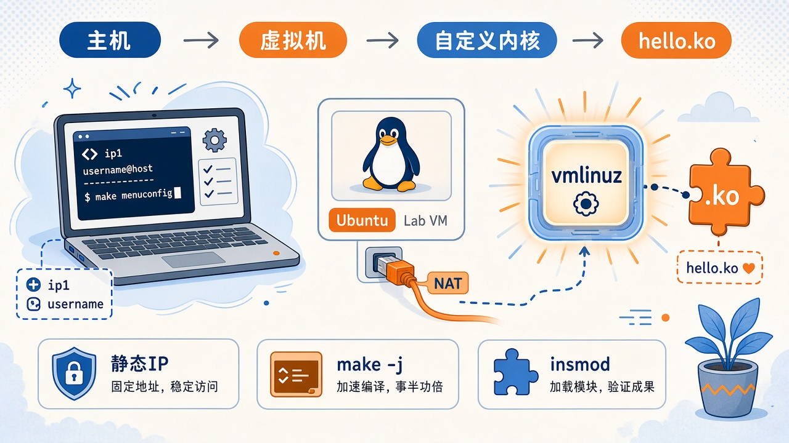

这篇要完成的事只有一件：**在 VMware 里的 Ubuntu 上，编译安装自己的内核，并加载一个自己写的 `.ko`。**

编译和换内核都在这台虚拟机里做，耗 CPU、内存和磁盘，还要进 GRUB。网络不稳时，长时间编译和 SSH 容易中断；内核没换上，模块也对不上正在跑的版本。因此先配静态 IP，再换内核，最后写模块。


{caption="主机 → Ubuntu 虚拟机 → 自己的 vmlinuz → hello.ko"}

> [!NOTE] 虚构示例
> 文中 `ip1`（宿主机在 VMnet8 上的地址）、`ip2`（NAT 网关）、`ip3`（虚拟机静态地址）、`username` 均为占位。请换成你 Virtual Network Editor 里看到的网段。

## 为何在虚拟机中编译内核 {#why-vm}

内核是操作系统最里面那一层：管 CPU、内存、磁盘、网卡和进程调度。终端、浏览器、`apt` 都在用户态，不能直接碰硬件，只能通过 `read`、`write`、`mmap` 等系统调用请内核代劳。

| 层级 | 例子 | 权限 |
| ---- | ---- | ---- |
| 用户态 | `bash`、浏览器、Python | 不能直接碰硬件 |
| 内核 | `vmlinuz`、调度器、驱动 | 唯一能直接操作硬件 |
| 硬件 | CPU、内存、网卡、磁盘 | — |

`uname -r` 打出来的就是**当前正在跑**的内核版本。后面编模块时，`.ko` 必须和这份内核用同一套头文件与 ABI，所以「先换成自己的内核」不是可选步骤。

主机是 Windows。虽然装过 Ubuntu 双系统，但更换内核可能影响已有软件依赖，所以没有在双系统那套 Ubuntu 上做这次实验，而是单独建了一台 VMware 虚拟机。编译仍会占磁盘、耗时间，但坏了可以回快照，不必拿日常环境试错。下面先给这台虚拟机配静态 IP，避免长时间编译时 DHCP 换地址、SSH 断开。

## 为虚拟机配置静态 IP {#static-ip}

VMware 的 **VMnet8** 默认是 NAT：虚拟机走宿主机上网。网卡只能跟同一网段的设备直接说话，出网段必须交给**默认网关**。包的路径是：

```text
Ubuntu → Gateway（通常是网段的 .2）→ VMware NAT → Windows 真实网卡 → 外网
```

### 记录 VMnet8 网段与网关 {#vmnet8}

打开 **Virtual Network Editor**，选 VMnet8：

| 字段 | 含义 | 本文占位 |
| ---- | ---- | -------- |
| Subnet IP | NAT 网段，形如 `x.x.x.0` | 网段本身 |
| Gateway IP | 虚拟交换机网关，通常是 `.2` | `ip2` |

再看 Windows：控制面板 → 网络和共享中心 → 更改适配器 → **VMware Network Adapter VMnet8**，宿主机在这张网上一般是 `.1`，本文写作 `ip1`。

| 适配器 | 用途 |
| ------ | ---- |
| VMnet0 | 桥接，进真实局域网，一般不用在编辑器里划网段 |
| VMnet1 | 仅主机，默认可 DHCP、不出网 |
| VMnet8 | NAT，虚拟机经宿主机访问外网 |

> [!WARNING]
> 网关填成 `ip1`（宿主机）而不是 `ip2`（NAT 网关）时，常见现象是：**能 ping 通 Windows，但上不了网。**

### 配置 Ubuntu 静态 IPv4 {#ubuntu-ipv4}

设置 → Network → IPv4 → **Manual**：

1. Address：`ip3`（同一网段，且不要占用 `.0` / `ip1` / `ip2`，也避开 DHCP 池）
1. Netmask：`255.255.255.0`（前 24 位）
1. Gateway：`ip2`
1. DNS：公共解析即可，例如 `8.8.8.8`、`223.5.5.5`（这是告诉系统「域名翻译服务器在哪」，不是你的机器 IP）
{.steps}

新开终端检查：

```bash
hostname -I
```

应能看到 `ip3`。至此这台实验机地址固定，可以安心编几个小时内核。

## 编译并安装自定义内核 {#build-kernel}

内核不必做成一块巨大的二进制。功能可以编进内核（`[*]`）、编成模块 `[M]`（生成 `.ko`，用时再加载）、或不编 `[ ]`。`lsmod` 看已加载的模块。

### 准备源码与 .config {#prepare}

查看当前版本，到 [kernel.org](https://www.kernel.org) 选**接近**的版本（下面以 `5.15.221` 为例；`uname -r` 若是 `5.15.0-139-generic`，选 5.15.x 比跨大版本更省事）：

```bash
uname -r
tar -Jxvf linux-5.15.221.tar.xz
cd linux-5.15.221
cp /boot/config-$(uname -r) .config
make olddefconfig
```

| `tar` 选项 | 含义 |
| ---------- | ---- |
| `-J` | xz 压缩 |
| `-x` | 解包 |
| `-v` | 列出文件名 |
| `-f` | 后面是归档文件 |

`make olddefconfig`：在已有 `.config` 上补全新选项的默认值，不弹问答。它只更新配置，不编译内核。

kernel.org 原版源码里没有 Ubuntu 那两份证书文件，需要把信任链路径清空，否则配置会指向不存在的文件：

```bash
./scripts/config --file .config --set-str SYSTEM_TRUSTED_KEYS ''
./scripts/config --file .config --set-str SYSTEM_REVOCATION_KEYS ''
```

| 选项 | 原本作用 |
| ---- | -------- |
| `CONFIG_SYSTEM_TRUSTED_KEYS` | 把可信 CA 编进内核，校验模块签名等 |
| `CONFIG_SYSTEM_REVOCATION_KEYS` | 编进已吊销的证书 |

要确认「开机的是自己编的那份」，可在 `init/main.c` 的 `start_kernel()` 开头加一行（行号随版本会变）：

```c
printk(KERN_ALERT "Hello, World! This is a custom kernel!\n");
```

### 编译与磁盘空间 {#compile}

第一次编译很久，虚拟机核心数、内存、**剩余磁盘**都要够。先看空间：

```bash
df -h /
```

实测：

| 配置 | 磁盘 |
| ---- | ---- |
| 保留默认 debug 信息 | **40G 虚拟盘不够** |
| 关闭调试信息后再编 | 大约 **30G** 可以编完 |

不够就关掉调试信息后再 `make olddefconfig`：

```bash
./scripts/config --disable DEBUG_INFO_BTF_MODULES
./scripts/config --disable DEBUG_INFO_BTF
./scripts/config --disable DEBUG_INFO_DWARF4
./scripts/config --disable DEBUG_INFO_DWARF_TOOLCHAIN_DEFAULT
./scripts/config --disable DEBUG_INFO_REDUCED
./scripts/config --disable DEBUG_INFO_COMPRESSED
./scripts/config --disable DEBUG_INFO_SPLIT
./scripts/config --disable DEBUG_INFO
./scripts/config --disable NFSD
make olddefconfig
```

然后（`-j` 不要超过虚拟机 CPU 核数）：

```bash
sudo make -j8
```

编完源码根目录应出现 `modules.order`（完整编完模块后的清单）。GCC 在这里的角色很简单：把 `.c` 译成内核/模块能跑的机器码。

### 磁盘写满后的扩容 {#disk-full}

编译把根分区写满时，**不要立刻关机去做虚拟机扩容**。系统空间为 0 时直接关机，可能再也进不去桌面（黑屏）。

应先在还能进系统时清出一点空间（例如删临时文件、未完成的编译产物），再关机。然后在 VMware 虚拟机设置里把虚拟磁盘调大。扩容只增大 `.vmdk`，客户机里多出来的是**未分配**空间，还要用分区工具并进文件系统。

1. 仍能进入 Ubuntu 时：安装并打开 GParted，把根分区扩展到未分配区域。
1. 已经黑屏、无法进入系统时：用 Ubuntu 安装镜像启动，选 **Try Ubuntu**，在 Live 环境里打开 GParted，同样把扩容后多出的未分配空间并进根分区。
{.steps}

> [!WARNING]
> 先清空间再关机，再改虚拟机磁盘大小。满盘关机后再扩容，常见结果是进不了系统，只能走 Live USB / 映像的 Try Ubuntu。

### 安装、更新 GRUB、验证 {#install}

```bash
sudo make INSTALL_MOD_STRIP=1 modules_install
sudo make install
ls /lib/modules/5.15.221
sudo update-grub
```

重启后应能进新内核。`make install` 之后，GRUB 第一项通常已经是刚编的版本。

> [!NOTE] 补充（本次未用）
> 若要进 BIOS 改启动项，可在虚拟机关机后编辑对应 `.vmx`，末尾加一行（一次性：开机后会被改回 `FALSE`）：`bios.forceSetupOnce = "TRUE"`。Windows 若看不见后缀：资源管理器 → 查看 → 显示 → 勾选「文件扩展名」。

加载时应能在内核日志里看到自定义 `printk`。确认：

```bash
uname -r
sudo dmesg | grep -i hello
```

`uname -r` 变成 `5.15.221`（或你编的版本），`dmesg` 里有那句 Hello，这一段才算完成。**后面的模块会按 `uname -r` 去找 `/lib/modules/.../build`，所以必须先走到这一步。**

## 编写并加载内核模块 {#hello-module}

模块是「不必重编整颗内核、又能跑在内核里」的那一层。它会 `insmod` 进**正在运行**的内核，因此必须走内核自带的 Kbuild，而不是 `gcc hello.c -o hello`。目录用当前内核的构建树：`/lib/modules/$(uname -r)/build`。

### 源码与 Makefile {#module-src}

在干净目录创建 `hello_module.c`：

```c
#include <linux/module.h>
#include <linux/kernel.h>
#include <linux/init.h>

static int __init hello_init(void)
{
	printk(KERN_INFO "Hello, Kernel!\n");
	return 0;
}

static void __exit hello_exit(void)
{
	printk(KERN_INFO "Goodbye, Kernel!\n");
}

module_init(hello_init);
module_exit(hello_exit);

MODULE_LICENSE("GPL");
MODULE_AUTHOR("username");
MODULE_DESCRIPTION("A simple hello world Linux kernel module");
MODULE_VERSION("1.0");
```

> [!WARNING] 看不见的空格
> 从网页复制时，行里可能混入不间断空格（NBSP）。gcc 会把 `#include` 行末的 NBSP 当成多余符号，把行首 NBSP 报成 `stray '\302'`。用普通空格即可。

同一目录 `Makefile`（配方行必须是 **Tab**，不能是空格）：

```makefile
obj-m += hello_module.o

all:
	make -C /lib/modules/$(shell uname -r)/build M=$(PWD) modules

clean:
	make -C /lib/modules/$(shell uname -r)/build M=$(PWD) clean
```

| 片段 | 含义 |
| ---- | ---- |
| `obj-m` | 编成模块 `.ko`（`m` = module；`obj-y` 才是编进 `vmlinuz`） |
| `-C .../build` | 进入**当前正在跑的内核**的 Kbuild |
| `M=$(PWD)` | 模块源码在当前目录（out-of-tree） |
| `$(shell uname -r)` | 自动对齐版本，避免和上一节装的内核错位 |

### 加载与卸载 {#insmod}

```bash
make
sudo insmod hello_module.ko
sudo dmesg | tail
sudo rmmod hello_module
sudo dmesg | tail
make clean
```

成功时日志里会有 `Hello, Kernel!` 和卸载后的 `Goodbye, Kernel!`。`make` 日志里 `Entering directory` 应指向你上一节安装的那份内核源码/build，而不是发行版自带的另一棵树。

## 小结 {#summary}

| 步骤 | 产出 | 下一步为什么需要它 |
| ---- | ---- | ------------------ |
| VMnet8 静态 IP | 固定的 `ip3`，NAT 能上网 | 长时间编译、SSH 进虚拟机时地址不会飘 |
| 自定义内核安装成功 | `uname -r` 变成自己编的版本 | 模块必须跟正在跑的内核同一套 ABI |
| `hello_module.ko` + `insmod` | `dmesg` 里看到 Hello | 证明「内核 + 模块」整条实验链通了 |

下次若 `insmod` 失败，先查 `uname -r` 和 `ls /lib/modules/$(uname -r)/build`，确认是否还在发行版内核上，或 Makefile 是否指错了构建树。
