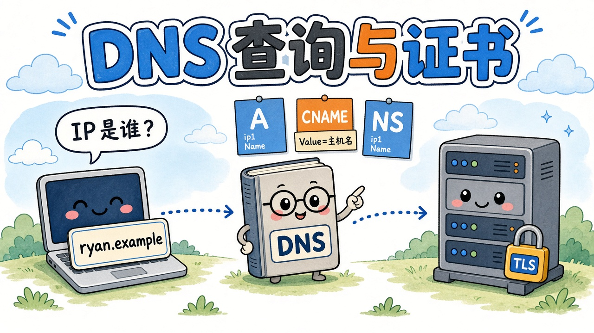

When connecting a personal site to a custom domain, the console presents CNAME, A, and sometimes TXT records. These notes follow the process from the browser finding an IP address, through the purpose of each record type, to the point where HTTPS certificates enter the chain.


{caption="Name → DNS records → machine; TLS proves that the name belongs to the server"}

> [!NOTE] About the examples
> `0412.online` and `ryan.0412.online` are this site's public domains. The CNAME target, verification string, and mail hostname are **illustrative**.

## What DNS does {#what}

DNS translates domain names: people remember `ryan.0412.online`, while machines connect to an IP address.

When a browser opens a URL, roughly:

1. It checks the local cache and uses a cached answer if available.
1. Otherwise, it asks the **DNS server configured locally**, a recursive resolver.
1. That server queries the global hierarchy until an authoritative server supplies the record.
{.steps}

> [!IMPORTANT] The browser does not query the root itself
> The configured DNS service performs the recursive lookup. It may be your ISP, `1.1.1.1`, your router, or a service run locally by proxy software. Answers are cached for a period specified by the TTL, so changing a record does not update the entire world immediately.

Where local DNS settings come from:

- **Automatic**: DHCP supplies them when you connect to Wi-Fi or Ethernet, often pointing to your ISP or router.
- **Manual**: a resolver address is entered in the network adapter's IPv4 settings.
- **Proxy / VPN**: some software points system DNS at loopback and performs lookups locally. Like Git using a local proxy port, the request first goes through another program.

## Resource records: an entry in the ledger {#rr}

A **Resource Record (RR)** is a rule in authoritative DNS: a name, a type, a value, and a cache lifetime.

| Field | Meaning | Example |
| ----- | ------- | ------- |
| Hostname / Name | Which name the rule applies to | `@` for the apex, `www`, `ryan` |
| Type | Kind of record | `A`, `CNAME`, `NS`, etc. |
| TTL | How long others may cache it | `600` = 10 minutes |
| Value | What it points to | An IP address or another hostname |

The value's meaning depends on the type. **A / AAAA / CNAME** are most relevant to opening websites. **NS / SOA / MX / TXT** govern zone ownership, mail, and verification; browsers usually do not read the latter types when requesting a page.

## A / AAAA / CNAME {#address}

### A: name → IPv4 {#a}

An A record identifies the IPv4 address for a name. When connecting the apex domain, `0412.online`, to Vercel, the console often asks for an **A** record because many DNS panels do not permit CNAME at the apex.

The limitation is that an IP change requires a record update. Subdomains more commonly use CNAME, leaving the cloud provider to update the target's IP.

### AAAA: name → IPv6 {#aaaa}

The same idea as A, but for IPv6. Dual-stack sites often have both A and AAAA records.

### CNAME: name → another name {#cname}

**CNAME means Canonical Name, or an alias.** It does not supply an IP; it tells the resolver to look up another name instead.

```text
ryan.0412.online.    CNAME    xxxxxxxxxxxxxxxx.vercel-dns-017.com.
```

Resolution proceeds as follows:

1. Query `ryan.0412.online` → receive a CNAME → the DNS target hostname assigned by Vercel.
1. Query that hostname → receive A/AAAA records → obtain an IP.
1. The browser connects to that IP while still using your domain in TLS/HTTP.
{.steps}

Remember: **Name is your label; Value is the hostname assigned by the other provider for DNS to locate the machine.** It is usually not `xxx.vercel.app`, which people open in a browser, but the hashed `….vercel-dns-017.com.` target shown in the console.

Key points:

- Value **must be a hostname**, not an IP. Use A for an IPv4 address.
- The trailing `.` marks a fully qualified name so that your suffix is not appended again.
- A name with a CNAME generally cannot also have A, MX, or TXT records.
- The hash prefix is a **project-specific identifier**. It belongs to your Vercel project: do not copy the public `cname.vercel-dns.com` from a tutorial or another project's hash.

## NS / SOA / MX / TXT {#other}

These four do not supply the website's destination address. Web access uses A/CNAME.

### NS: who answers for this zone? {#ns}

**Name Server** records point not to the website but to the provider authorized to answer questions for the zone: where the ledger is kept.

After buying `0412.online`, you may see:

```text
0412.online.    NS    f1g1ns1.dnspod.net.
0412.online.    NS    f1g1ns2.dnspod.net.
```

This means DNSPod / Tencent Cloud DNS supplies the authoritative A and CNAME records.
**Changing DNS providers means changing NS**, not changing each A record. If NS points elsewhere, editing CNAME in the old panel has no effect.

### SOA: the ledger's cover page {#soa}

**Start of Authority**. Each zone has one, containing its primary DNS server, administrator email, serial number, and refresh interval. The panel generates it automatically; adding a website does not require editing it manually.

### MX: where mail goes {#mx}

**Mail Exchanger**. It is queried when mail is sent to an address such as `xxx@0412.online`; opening a website does not use MX.

```text
0412.online.    MX    10  mx1.example.com.
```

The number is the priority: lower values are preferred. A/CNAME for a website and MX for mail can coexist, subject to the CNAME restriction. A domain without hosted email can have no MX and still serve a website.

That restriction is another reason to avoid CNAME at the apex: the same name cannot also hold MX records. Using CNAME for the `ryan.0412.online` subdomain avoids this issue.

### TXT: a note for machines {#txt}

A TXT value is plain text, ignored by the browser when fetching a page. It can let another company confirm that **you control the domain**.

For example, a platform may ask you to add:

```text
0412.online.    TXT    "vercel-verification=abcd1234"
```

The platform checks the string in authoritative DNS and allows the domain to be attached to your project only if it matches. Otherwise, anyone could type someone else's domain into their console.

Email anti-spoofing mechanisms such as SPF also use TXT and likewise do not supply a website's address.

## How TLS certificates fit in {#tls}

DNS answers “which machine?” TLS certificates help establish “does this machine really represent this name?” and TLS protects the connection against eavesdropping.

```text
1. DNS: ryan.0412.online → IP (NS locates the zone, then A/CNAME supplies the address)
2. TCP: connect to port 443 on that IP
3. TLS: request the certificate, verify the name, and encrypt
4. HTTP: request the web page
```

The certificates discussed here are issued for **domain names**, not an IP. The browser checks the name in the address bar. Many Vercel sites share an IP, and the hostname in the handshake, SNI, selects the appropriate certificate.

Certificate issuance often involves DNS. Two common validation methods are:

| Method | What the CA does | Records involved |
| ------ | ---------------- | ---------------- |
| **HTTP-01** | Visits `http://你的域名/.well-known/acme-challenge/...`, substituting your domain | A/CNAME must already point to a machine that can answer |
| **DNS-01** | Queries a TXT record at `_acme-challenge.…` | TXT |

After connecting the domain to Vercel, the platform usually manages certificate requests. You rarely add `_acme-challenge` yourself. The verification TXT commonly shown in the console lets **Vercel verify domain ownership**; it is not the same record as a CA challenge.

## Summary {#summary}

| Role | Mechanism |
| ---- | --------- |
| Find the authoritative ledger | NS |
| Locate the website | A / AAAA / CNAME |
| CNAME Value | Provider-assigned DNS target hostname, possibly including a project hash |
| Mail | MX |
| Prove domain ownership | TXT |
| Padlock / HTTPS | TLS certificate, after DNS has found the IP |

When filling in a CNAME: **put your host label, such as ryan, in Name; copy the complete Value from Vercel's domain page. Do not invent it or enter an IP.**
