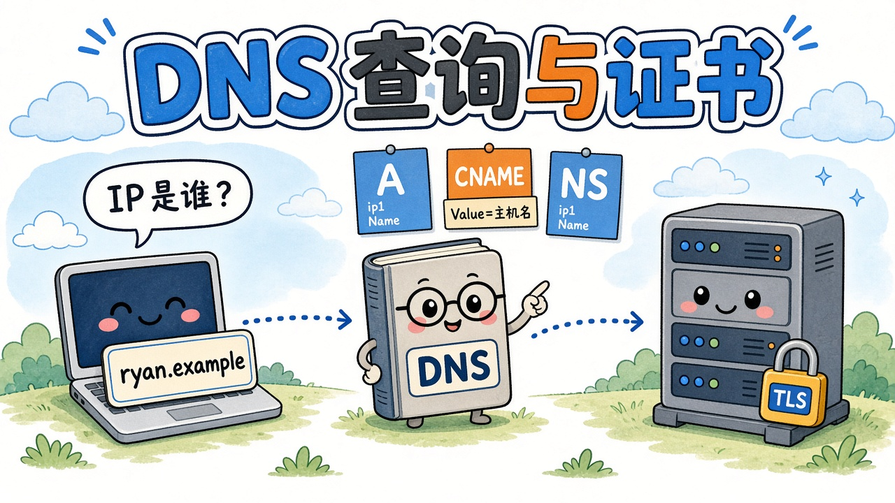

把个人站绑到自定义域名时，控制台会甩出 CNAME、A、有时还有 TXT。这篇把最近查 DNS 的笔记整理成一条线：浏览器怎么查出 IP、账本上每一类记录在干什么，以及 HTTPS 证书卡在这条链的哪一截。


{caption="名字 → DNS 记录 → 机器；TLS 负责证明这块牌子是真的"}

> [!NOTE] 示例说明
> 文中 `0412.online` / `ryan.0412.online` 是本站已经公开的域名。CNAME 目标、验证串、邮件主机名为**示意**。

## DNS 在干什么 {#what}

DNS 是域名的翻译官：人记 `ryan.0412.online`，机器连的是 IP。

浏览器打开一个网址时，大致是：

1. 先看本机缓存，有就直接用
1. 没有就问 **本机配置的 DNS 服务器**（递归解析器）
1. 这台服务器再从全球目录一层层问，直到权威服务器给出记录
{.steps}

> [!IMPORTANT] 浏览器自己不会去问根
> 真正一层层问的是本机填的那台 DNS（运营商、`1.1.1.1`、路由器，或代理软件在本机开的服务）。查到的结果会缓存一段时间（TTL），所以改记录后不是全世界立刻生效。

本机 DNS 从哪来：

- **自动**：连 Wi-Fi / 网线时 DHCP 下发，多半是运营商或路由器自己
- **手动**：网卡 IPv4 里写死解析器地址
- **代理 / VPN**：有的软件把系统 DNS 指到本机回环，由本地程序代查（和 git 走本地代理端口是同一类「先转到某个程序」）

## 资源记录：账本上的一行 {#rr}

**Resource Record（RR）** 是权威 DNS 里的一条规则：某个名字、某种类型、对应什么值、缓存多久。

| 字段 | 含义 | 例子 |
| ---- | ---- | ---- |
| 主机名 / Name | 这条规则管哪个名字 | `@`（根）、`www`、`ryan` |
| 类型 / Type | 规则种类 | `A`、`CNAME`、`NS`… |
| TTL | 别人可以缓存多久 | `600` = 10 分钟 |
| 值 / Value | 指向什么 | IP，或另一个主机名 |

类型不同，值的含义就不同。打开网页最常用的是 **A / AAAA / CNAME**；**NS / SOA / MX / TXT** 管账本归属、邮件和验证，浏览器要网页时通常不读后几种。

## A / AAAA / CNAME {#address}

### A：名字 → IPv4 {#a}

这个名字对应哪台 IPv4 机器。根域名（`0412.online`）绑 Vercel 时，控制台常常让你加 **A**，因为很多面板不允许根域名用 CNAME。

限制：IP 变了你得改记录。所以子域名更常写 CNAME，IP 换了由云厂商那边改。

### AAAA：名字 → IPv6 {#aaaa}

和 A 一样，只是 IPv6。双栈站点常常 A 和 AAAA 各一条。

### CNAME：名字 → 另一个名字 {#cname}

**CNAME = Canonical Name（规范名 / 别名）。** 不给 IP，而是说：别查我，去查那个名字。

```text
ryan.0412.online.    CNAME    xxxxxxxxxxxxxxxx.vercel-dns-017.com.
```

解析过程：

1. 问 `ryan.0412.online` → 得到 CNAME → Vercel 分配的那台解析用主机名
1. 再问那个主机名 → 得到 A/AAAA → IP
1. 浏览器连这个 IP，TLS/HTTP 里仍带你的域名
{.steps}

可以记成：**Name 是你的牌子，Value 是对方分配给你、给 DNS 找机器用的主机名。** 它通常不是 `xxx.vercel.app`（给人用浏览器打开的地址），而是控制台里那串带哈希的 `….vercel-dns-017.com.`。

要点：

- Value **必须是主机名**，不能填 IP（IP 请用 A）
- 末尾 `.` 表示这是完整名字，不要再拼你的后缀
- 同一个名字一旦是 CNAME，通常不能再同时有 A、MX、TXT（别名就是别名）
- 哈希前缀是 **项目门牌**：只属于你这个 Vercel 项目，不要抄网上公共的 `cname.vercel-dns.com`，也不要抄别人的哈希

## NS / SOA / MX / TXT {#other}

这四个都不负责「打开网页」。网页靠 A/CNAME。

### NS：这个区域听谁的 {#ns}

**Name Server**：不指向网站，而指向「谁有权回答这个区域的问题」——账本放在哪家运营商。

买了 `0412.online` 之后，会有类似：

```text
0412.online.    NS    f1g1ns1.dnspod.net.
0412.online.    NS    f1g1ns2.dnspod.net.
```

意思是：下面所有 A、CNAME 以 DNSPod / 腾讯云解析为准。  
**换解析商改的是 NS**，不是一条条 A。NS 指错地方，你在旧面板里改 CNAME 不会生效。

### SOA：账本封面 {#soa}

**Start of Authority**。每个区域一条，写主 DNS、管理员邮箱、序列号、刷新间隔。面板自动生成，加网站时不用手改。

### MX：邮件往哪送 {#mx}

**Mail Exchanger**。只在有人寄信到 `xxx@0412.online` 时才被问到；打开网页完全不看 MX。

```text
0412.online.    MX    10  mx1.example.com.
```

前面的数字是优先级，越小越优先。网站用 A/CNAME、收信用 MX，可以同时存在。从没做企业邮箱就可以没有 MX，网站照样能开。

根域名少用 CNAME，也是因为同一个名字若是 CNAME 就不能再挂 MX。子域名 `ryan.0412.online` 用 CNAME 没有这个问题。

### TXT：给机器看的字条 {#txt}

值就是普通文字，浏览器当它不存在。用来让别的公司确认：**你真的管得了这个域名。**

例如平台让你加：

```text
0412.online.    TXT    "vercel-verification=abcd1234"
```

对方去权威 DNS 上核对字符串，对上才允许把域名绑到你的项目。否则谁都能在控制台填别人的域名。

发信防伪（SPF 等）也是 TXT，同样不参与打开网页。

## 和 TLS 证书的关系 {#tls}

DNS 解决「去哪台机器」。TLS 证书解决「这台机器是不是真的叫这个名字，路上有没有人偷听」。

```text
1. DNS：ryan.0412.online → IP（NS 找到账本，再读 A/CNAME）
2. TCP：连上这个 IP 的 443 端口
3. TLS：要证书、核对名字、加密
4. HTTP：才开始要网页
```

证书签发给**域名**，不签发给 IP。浏览器核对的是地址栏里的名字。Vercel 许多站点共用 IP，靠握手里的主机名（SNI）拿出对应那张证。

签发时 CA 往往要查 DNS，常见两种：

| 方式 | CA 做什么 | 用到的记录 |
| ---- | --------- | ---------- |
| **HTTP-01** | 访问 `http://你的域名/.well-known/acme-challenge/...` | A/CNAME 必须已经指到能应答的机器 |
| **DNS-01** | 查 `_acme-challenge.…` 的一条 TXT | TXT |

绑到 Vercel 之后，证书一般由平台代申请。你很少手加 `_acme-challenge`；平时看到的验证 TXT 是给 **Vercel 认领域名**，和 CA 的挑战不是同一张字条。

## 小结 {#summary}

| 角色 | 靠什么 |
| ---- | ------ |
| 去哪本账本 | NS |
| 网站在哪 | A / AAAA / CNAME |
| CNAME 的 Value | 对方分配的解析用主机名（可含项目哈希） |
| 邮件 | MX |
| 证明域名是你的 | TXT |
| 小锁 / https | TLS 证书（发生在 DNS 找到 IP 之后） |

填 CNAME 时：**Name 写你的主机记录（如 `ryan`），Value 从 Vercel 域名页整段复制，不要自己编、不要填 IP。**
